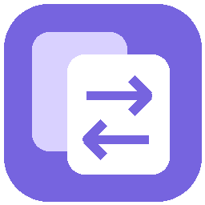
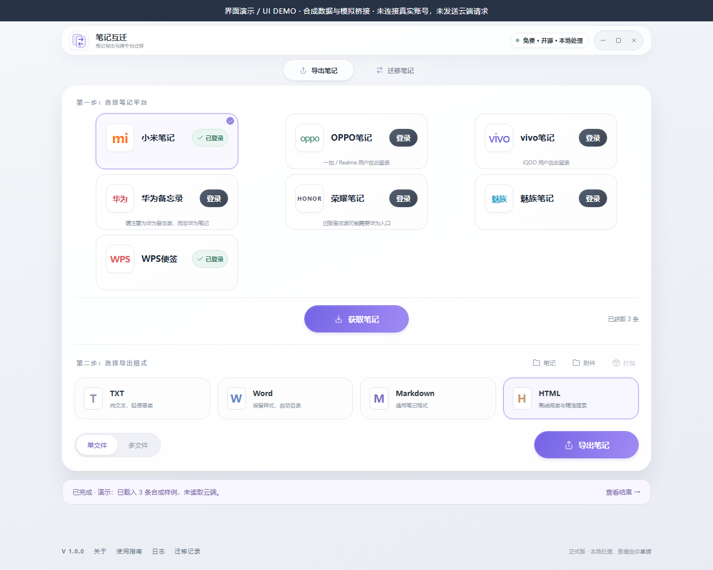

<h1 align="center">笔记互迁</h1>

<strong>换了手机，也把笔记带走。</strong>

七平台云端互迁 · 四种格式导出 · 免费开源

  <a href="https://github.com/lingxuanqjc-alt/note-bridge-desktop/releases/tag/v1.0.0">下载 Windows 版</a> ·
  <a href="docs/DEMO.md">观看演示</a> ·
  <a href="docs/PROJECT-CASE.md">项目案例</a> ·
  <a href="docs/VERIFICATION.md">验证记录</a> ·
  <a href="docs/GUIDE.md">使用指南</a> ·
  <a href="docs/COMPATIBILITY.md">兼容性说明</a> ·
  <a href="https://github.com/lingxuanqjc-alt/note-bridge-desktop/issues/new/choose">反馈问题</a>

  
  
  
  

换了手机品牌，旧笔记却留在原来的云端。笔记互迁是一款 Windows 桌面工具，帮助你选择具体笔记迁入另一个平台，或导出成可以自己保存、阅读和搜索的本地文件。

支持 **小米、OPPO、vivo、华为备忘录、荣耀、魅族、WPS**。当前版本为 **1.0.0 正式版**，具体支持范围和格式差异见下文。

*真实前端运行截图，使用合成数据与模拟桥接；未连接真实账号或发送云端请求。[查看短演示与边界](docs/DEMO.md)。*

**English:** Note Bridge is a Windows app for exporting notes to TXT, Markdown, HTML or DOCX and migrating selected notes across seven cloud platforms. It preserves source notes and reports format differences and uncertain writes. [Case study](docs/PROJECT-CASE.md#english-summary) · [Validation scope](docs/VERIFICATION.md)

<strong>目录</strong>

- [快速上手](#快速上手)
- [用它做什么](#用它做什么)
- [下载与启动](#下载与启动)
- [开始迁移](#开始迁移)
- [支持范围](#支持范围)
- [常见问题](#常见问题)
- [反馈与贡献](#反馈与贡献)

## 快速上手

第一次使用，建议按 **安装 → 先试导出 → 再迁移** 的顺序：导出只需登录来源账号，结果保存在本地，最容易熟悉流程。

1. **下载安装。** 运行 [Windows 安装包](https://github.com/lingxuanqjc-alt/note-bridge-desktop/releases/download/v1.0.0/NoteBridge-1.0.0-setup.exe)，完成后双击桌面“笔记互迁”。需要 Windows 10／11 x64 与 Microsoft WebView2 Runtime；缺少 WebView2 时安装程序会引导前往微软官方页面。
2. **先试导出。** 打开“导出笔记”页：登录来源平台 → 获取笔记 → 选择 TXT／Markdown／HTML／Word 与文件模式 → 导出到本地。
3. **再做迁移。** 打开“迁移笔记”页，登录迁出、迁入双方账号 → 点击“开始迁移” → 勾选笔记 → 点击“确认迁移 N 条”。完成后到目标端核对正文、图片与分组。

迁移向目标云端新增笔记，保留来源。每一步的细节与提示含义见[使用指南](docs/GUIDE.md)，下载文件与校验见[下载与启动](#下载与启动)。

## 用它做什么

| 你想做的事 | 笔记互迁提供的功能 |
| --- | --- |
| 换品牌，带走原来的笔记 | 登录双方云账号，选择笔记后迁入目标云端，保留来源笔记 |
| 留一份自己的备份 | 导出 TXT、Markdown、HTML、Word（DOCX），可合并文件或每条单独保存 |
| 离线查看和搜索 | HTML 自带目录、关键词搜索、月份筛选和媒体预览，连同附件打包带走 |
| 核对迁移结果 | 显示逐条结果、附件问题和格式差异，结果不明时保留回执供核对 |

## 下载与启动

**系统要求：Windows 10／11 x64，Microsoft WebView2 Runtime。**

| 下载文件 | 使用方式 |
| --- | --- |
| [Windows 安装包](https://github.com/lingxuanqjc-alt/note-bridge-desktop/releases/download/v1.0.0/NoteBridge-1.0.0-setup.exe) | 运行安装程序，之后双击桌面“笔记互迁” |
| [Windows 便携包](https://github.com/lingxuanqjc-alt/note-bridge-desktop/releases/download/v1.0.0/NoteBridge-1.0.0-windows-x64.zip) | 完整解压后双击 `NoteBridge.exe` |
| [源码 ZIP](https://github.com/lingxuanqjc-alt/note-bridge-desktop/releases/download/v1.0.0/note-bridge-desktop-1.0.0-source.zip) | 阅读源码或按[开发说明](README-development.md)自行构建 |

便携版请保留解压后的完整目录。安装程序检测到缺少 WebView2 时，会引导前往微软官方页面。

[下载与文件校验](docs/DOWNLOAD.md) · [查看版本说明](https://github.com/lingxuanqjc-alt/note-bridge-desktop/releases/tag/v1.0.0)

## 开始迁移

> 迁移向目标云端**新增**笔记，保留来源。可以先导出备份，再选择一条笔记熟悉流程。

1. **确认来源。** 来源云端已有笔记即可；尚未上传的内容，需要先从原手机开启笔记云同步，等待上传。
2. **登录双方账号。** 在软件“迁移笔记”页选择迁出、迁入平台，在打开的官方窗口完成登录，再检查账号状态。
3. **选择笔记并迁移。** 点击“开始迁移”，在随后出现的列表中勾选笔记、查看格式提示，再点击“确认迁移 N 条”。完成后查看结果，并到目标端核对正文、图片与分组。

**来源云端 → 笔记互迁 → 目标云端 → 目标手机**

目标手机需登录同一目标账号并开启厂商云同步。软件完成云端之间的迁移，厂商服务负责同步到手机，无需逐条复制粘贴。

只想备份时，打开“导出笔记”页：登录平台 → 获取笔记 → 选择格式和文件模式 → 导出到本地。详细操作见[使用指南](docs/GUIDE.md)。

## 支持范围

七个平台均支持读取与本地导出，迁入入口均已开放，并按各自限制执行：

| 平台 | 本地导出 | 云端迁入 | 平台特有说明 |
| --- | :---: | :---: | --- |
| 小米 | ✓ | ✓ | 迁入限已核实的非加密账号，单张图片不超过 4 MiB |
| OPPO | ✓ | ✓ | 服务端要求图片分片上传时，本版会停止处理并给出提示 |
| vivo | ✓ | ✓ | — |
| 华为备忘录 | ✓ | ✓ | 对应云服务为“备忘录” |
| 荣耀 | ✓ | ✓ | — |
| 魅族 | ✓ | ✓ | — |
| WPS | ✓ | ✓ | — |

各平台通用：

- **正文、分组与图片：** 在目标平台支持的范围内转换；当前云端迁入图片限 PNG/JPEG。音视频和其他附件可按支持范围导出到本地。
- **富文本差异：** 表格、代码和部分文字样式可能转为普通文字，软件会报告差异；专有手写、加密内容等不能视为全面兼容。
- 登录验证、云空间和网络条件仍由各厂商决定。

各平台的具体差异见[兼容性说明](docs/COMPATIBILITY.md)。

## 常见问题

**会删除原来的笔记吗？** 迁移向目标新增笔记，保留来源。可以先导出备份，再选择一条笔记熟悉流程。

**电脑上显示成功，手机怎么还没出现？** 先到目标官网查看内容，再检查手机账号、云同步和网络。云端写入成功不代表手机已经收到，请勿因此重复迁移同一批内容。

**能把备份拿到另一台电脑看吗？** 可以。HTML 离线阅读请携带完整 ZIP，保留其中的资源目录；仅复制 HTML 文件会缺少附件。

**页面要求重新登录，或者任务显示“需要核对”怎么办？** 登录窗口提供“页面 → 刷新当前页面／重新打开官网”。“需要核对”表示目标可能已经写入，请保留回执，先检查目标官网；重新登录不会清除这项保护。

## 反馈与贡献

通过 [Issues](https://github.com/lingxuanqjc-alt/note-bridge-desktop/issues/new/choose) 提交问题或建议。请说明软件版本、迁移方向、具体步骤及实际结果，并使用自行生成的内容举例。

[参与贡献](CONTRIBUTING.md) · [安全反馈](SECURITY.md) · [开发与构建](README-development.md) · [项目案例](docs/PROJECT-CASE.md) · [当前验证](docs/VERIFICATION.md)

登录在厂商官方页面完成。请勿在反馈中提交密码、验证码、Cookie、令牌或私人笔记。自写代码采用 [MIT 许可](LICENSE)，第三方依赖许可见 [licenses](licenses/README.md)。
