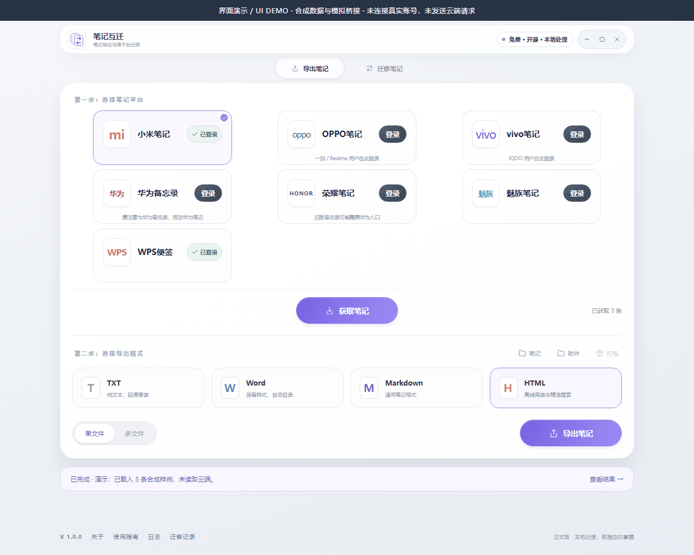
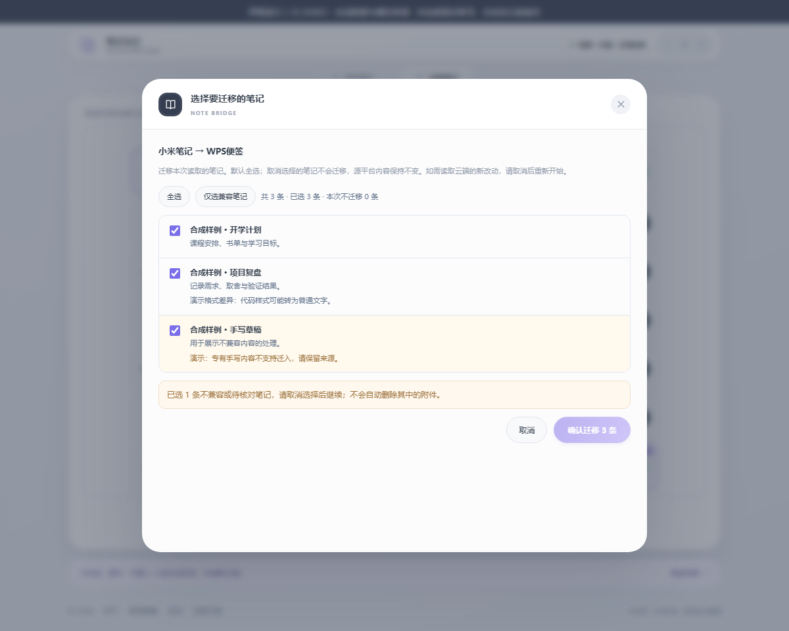
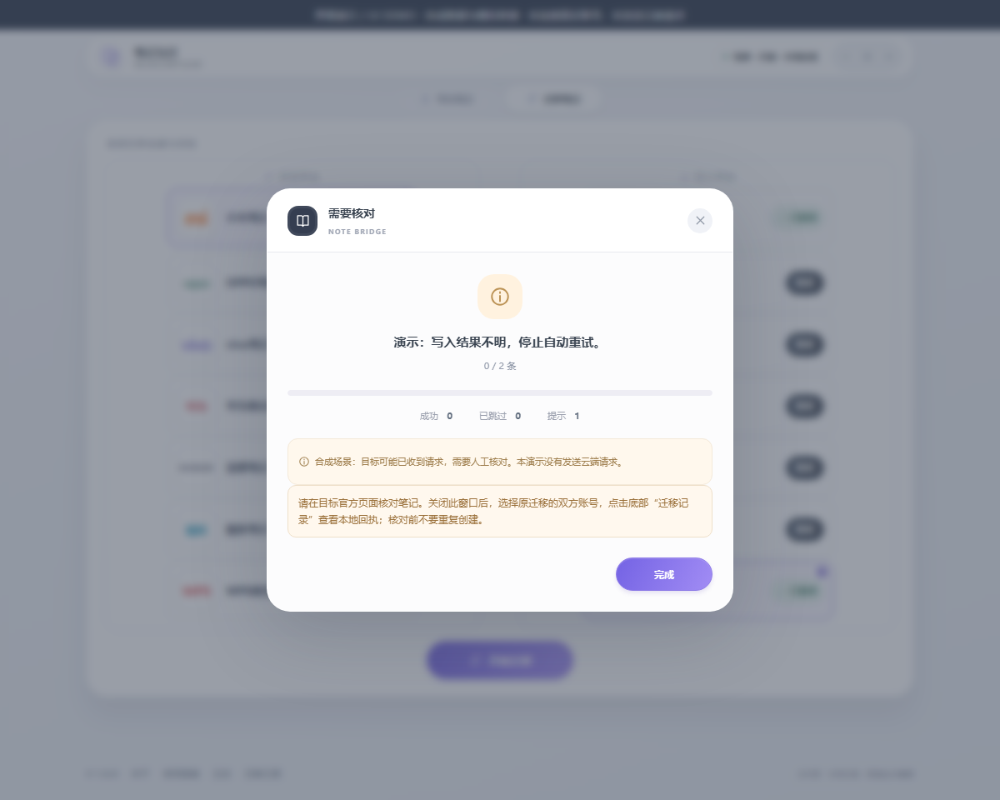

# 界面流程演示

[返回项目](../README.md) · [项目案例](PROJECT-CASE.md) · [验证范围](VERIFICATION.md)

以下素材在本地运行 1.0.0 的实际前端构建，由独立浏览器操作真实界面录制。账号状态、笔记内容和桥接返回值均为合成样例；没有连接厂商账号，没有读取私人笔记，也没有执行云端迁移。



[播放完整 WebM 录屏](../assets/portfolio/demo.webm)

| 步骤 | 可以观察的界面行为 | 不能由此推定 |
| --- | --- | --- |
| 1. 选择导出格式 | TXT、Word、Markdown、HTML 和单/多文件入口 | 本次录制实际生成了导出文件 |
| 2. 选择迁移方向 | 迁出与迁入平台分列 | 真实账号登录或厂商访问成功 |
| 3. 查看兼容性 | 不兼容项显示原因，禁止直接确认全部笔记 | 各平台的真实格式全面兼容 |
| 4. 仅选兼容笔记 | 排除手写合成样例，确认数量变为 2 | 云端确实写入了两条笔记 |
| 5. 查看待核对结果 | “需要核对”提示和停止重复创建的指引 | 任何真实云端写入发生或完成 |





## 复现素材

先按[开发说明](../README-development.md)安装项目依赖，另准备 Playwright、Chromium 及其视频编码组件。示例：

```powershell
npm run build --prefix ui
node scripts/capture-portfolio.cjs
```

已有独立 Playwright 安装时，可设置 `PLAYWRIGHT_MODULE_PATH`；`CHROME_PATH` 可指定独立浏览器可执行文件。脚本只运行临时浏览器环境和 localhost 服务，不连接用户日常浏览器会话。所有外部页面请求都会被阻止，并检查请求数量为 0。

输出位于 Git 忽略的 `.private/portfolio-evidence/`。先检查截图、录屏与 `evidence.json`，再把确认可公开的素材复制到 `assets/portfolio/`。GIF 由同一流程的五张真实截图按顺序展示；WebM 保留操作过程。合成桥接仅在采集脚本中注入，不进入应用的前端构建。
